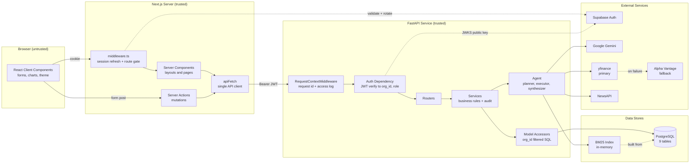
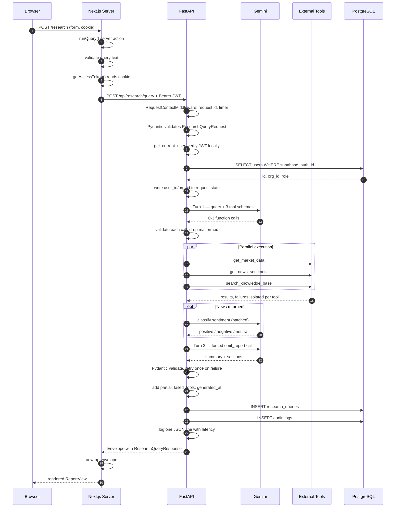
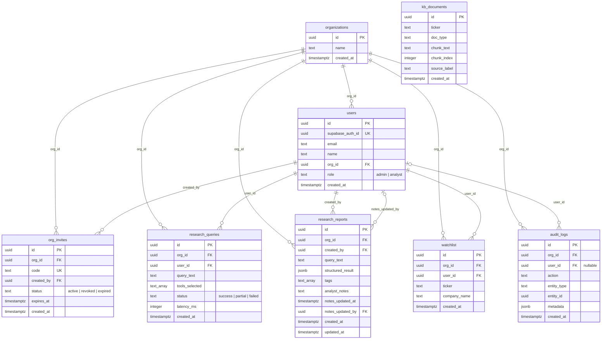
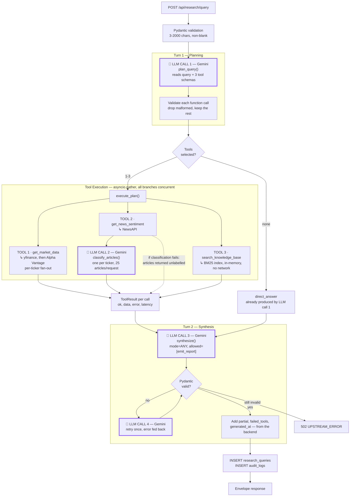
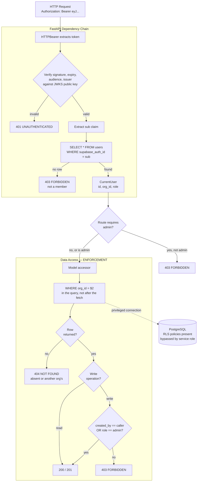

# Architecture

**FinLens.ai: Investment Research Dashboard**

A multi-tenant SaaS platform where equity analysts ask natural-language research
questions and an LLM agent decides, per query, which data sources to consult
before returning a structured, source-attributed report.

---

## Table of Contents

1. [System Overview](#1-system-overview)
2. [System Architecture](#2-system-architecture)
3. [Data Flow](#3-data-flow)
4. [Database Schema](#4-database-schema)
5. [AI Orchestration](#5-ai-orchestration)
6. [Multi-Tenant Data Flow](#6-multi-tenant-data-flow)
7. [API Design](#7-api-design)
8. [Security Architecture](#8-security-architecture)
9. [Folder Structure](#9-folder-structure)
10. [Architectural Patterns](#10-architectural-patterns)
11. [Design Decisions](#11-design-decisions)
12. [Not Implemented](#12-not-implemented)

---

## 1. System Overview

### 1.1 Purpose

Analysts type a question in plain language *"Analyze NVIDIA's Q3 earnings,
compare revenue growth with AMD and Intel, summarize competitive threats and
news sentiment, give a risk assessment"*  and receive a structured report
rendered as typed UI components, with every section carrying its own confidence
rating and source attribution.

The distinguishing behaviour is that **tool selection is decided by the model per
query**. There is no keyword routing anywhere in the codebase. A question about
news reaches the news tool and not the market-data tool because the model chose
so; a question about what a P/E ratio means reaches no tools at all.

### 1.2 Core Features

| Feature | Implementation |
|---|---|
| Natural-language research queries | Two-turn Gemini agent with function calling |
| Per-query tool selection | Turn 1 planning; 0–3 of 3 tools |
| Parallel tool execution | `asyncio.gather` with per-tool timeout and isolation |
| Graceful degradation | One tool failing yields `partial: true`, not a 500 |
| Structured output | Forced `emit_report` tool call, validated by Pydantic |
| LLM news sentiment | Batched classification via constrained decoding |
| Saved reports (CRUD) | Org-shared read; creator-or-admin write |
| Analyst notes | Separate column, never mutating the agent's output |
| Query history | Written on every path, including failures |
| Watchlist | Per user within an org |
| Organisation management | Admin-gated members and invite codes |
| Multi-tenancy | `org_id` filter in every query; RLS as a second layer |
| Audit trail | Every mutation recorded, org-scoped |

### 1.3 Technology Stack

| Layer | Technology | Notes |
|---|---|---|
| Frontend | Next.js 14 (App Router), TypeScript, Tailwind, shadcn/ui | Server Components by default |
| Backend | FastAPI (Python 3.13), async | Layered: routes → services → models |
| Database | PostgreSQL via Supabase | Accessed directly with `asyncpg` |
| Authentication | Supabase Auth (JWT, ES256/RS256) | Asymmetric; backend verifies only |
| LLM | Google Gemini — `gemini-3.6-flash` | Planning, synthesis, sentiment |
| Market data | yfinance (primary), Alpha Vantage (fallback) | Both behind one `MarketDataClient` Protocol |
| News | NewsAPI | Sentiment supplied by the LLM, not the provider |
| Knowledge base | BM25 (`rank_bm25`) over `kb_documents` | Lexical; no embeddings |

### 1.4 Architecture Style

**Layered monolith with an agentic AI subsystem, deployed as two services.**

- The backend is a layered monolith: HTTP routes are thin, business rules live in
  services, and data access is isolated in model accessors.
- The AI subsystem is agent-based: an LLM plans, tools execute concurrently, and
  a second LLM turn synthesises - orchestrated by the backend, not by the model.
- The frontend is component-based with server-side data fetching. No client
  component calls the API; this is enforced at build time.
- Communication is **REST**, not GraphQL.

### 1.5 Key Design Decisions

| Decision | Rationale |
|---|---|
| REST over GraphQL | Fixed access patterns; tenant isolation enforced once per endpoint rather than per resolver |
| Application-level tenant filtering as the primary defence | The API connects with a privileged role that RLS does not constrain |
| 404 rather than 403 for foreign-tenant resources | A 403 would confirm the resource exists |
| Loose LLM tool schema, strict Pydantic validation | A `oneOf` union is followed unreliably; a rejected response costs a full retry |
| `partial`, `failed_tools`, `generated_at` set by the backend | The model cannot reliably self-report what it never received |
| Report stored as `jsonb` | A saved report is a frozen snapshot and must render identically forever |
| Role read from Postgres, not the JWT | A demoted admin loses access on the next request, not at token expiry |
| Analyst notes in a separate column | Source attribution depends on the agent's output being untouched |

---

## 2. System Architecture

Three trust zones. The browser stores the session as an opaque cookie and never
reads it. The Next.js server unpacks that cookie to obtain the access token, and
is the sole client of the API. The FastAPI service holds every credential,
database, LLM and news provider, and is the only component that reaches them.



**Figure 1: System architecture.** Solid arrows are request paths; dashed arrows
are verification or index-population paths.

Two properties are worth noting:

- **The browser never calls FastAPI.** All API traffic originates from the
  Next.js server. `src/lib/api/resources.ts` carries `import "server-only"`,
  making a client-side import a build error.
- **Supabase is reached in two different ways.** The Next.js middleware calls
  the Auth API over the network to validate and rotate sessions; FastAPI
  downloads the JWKS public key once and verifies tokens locally thereafter.

---

## 3. Data Flow

The following traces `POST /api/research/query` which is the most complex path in the
system, from the browser to the rendered report.



**Figure 2: End-to-end request trace for a research query.**

No step is elided. Validation occurs three times on distinct concerns: input
shape (Pydantic), caller identity (JWT plus database lookup), and model output
(Pydantic against the Turn-2 contract).

---

## 4. Database Schema

Nine tables. Eight carry `org_id` and are tenant-scoped; `kb_documents` is a
shared reference corpus with no tenant column, because a public filing excerpt
belongs to no single organisation.



**Figure 3: Entity relationship diagram.** Each relationship is labelled with the
foreign-key column that creates it. `kb_documents` is intentionally unconnected:
it has no tenant relationship.

#### How to read the diagram

The notation is **crow's foot**. Each line is one foreign key, and the label is
the column that creates it.

**Step 1: three marks, three meanings.**

| Mark | Appearance | Meaning |
|:---:|---|---|
| `\|` | a bar across the line | one |
| `o` | a small circle | zero |
| `{` `}` | a three-pronged fork | many |

**Step 2: they appear in pairs, and each pair describes the end it sits on.**

| Pair | Reads as |
|:---:|---|
| `\|\|` | exactly one |
| `\|o` | zero or one |
| `o{` | zero or many |

**Step 3: read the line from both ends.** Take the first relationship:

```
organizations ||--o{ users : "org_id"
              ^^     ^^
              |      └── describes the USERS end:         zero or many
              └───────── describes the ORGANIZATIONS end: exactly one
```

- Left to right: *one organization has **zero or many** users.*
- Right to left: *one user belongs to **exactly one** organization.*

Both statements come from the same line. "One-to-many" and "many-to-one" are the
same relationship read in opposite directions, not two different things.

**Step 4: the marks map directly to the SQL.**

| Column definition | Renders as | Because |
|---|:---:|---|
| `org_id uuid not null references organizations(id)` | `\|\|` | `not null` — the row cannot exist without a parent |
| `notes_updated_by uuid references users(id)` | `\|o` | nullable — the row can exist with no parent |

A single word, `not null`, is the entire difference between `||` and `|o`.

**Step 5: Two tables can be joined more than once.**

`users` and `research_reports` have **two** lines between them, because the
schema has two separate foreign keys:

| Line | Column | Question it answers | Can it be zero? |
|---|---|---|---|
| `\|\|--o{` | `created_by` | Who saved this report? | **No** — `not null`, always exactly one |
| `\|o--o{` | `notes_updated_by` | Who wrote the analyst note? | **Yes** — most reports have no note |

In the seeded data all 7 reports have an author, while 6 of 7 have no note author
— which is precisely the difference between `||` and `|o`.

**Step 6: Cardinality is not deletion behaviour.** The diagram shows whether a
row *can exist*; it does not show what happens when a parent is removed. That is
`on delete cascade` versus `on delete set null`, covered in
[4.2](#42-referential-integrity).

### 4.1 Constraints

| Constraint | Table | Purpose |
|---|---|---|
| `check (role in ('admin','analyst'))` | `users` | Role validity enforced by the database |
| `check (status in ('success','partial','failed'))` | `research_queries` | Query status validity |
| `check (status in ('active','revoked','expired'))` | `org_invites` | Invite lifecycle validity |
| `unique (supabase_auth_id)` | `users` | One application user per auth account |
| `unique (code)` | `org_invites` | A code resolves to exactly one organisation |
| `unique (org_id, user_id, ticker)` | `watchlist` | No duplicate pins |
| `not null` on every `org_id` | 7 tables | A tenant-scoped row cannot exist without a tenant |

### 4.2 Referential Integrity

All foreign keys cascade on delete, with two deliberate exceptions:

| Foreign key | On delete | Reason |
|---|---|---|
| `audit_logs.user_id` | `set null` | Deleting a user must not erase the audit trail |
| `research_reports.notes_updated_by` | `set null` | A cleared author must not delete the report |
| *all others* | `cascade` | Removing an organisation removes its data |

### 4.3 Indexes

Each index serves a query the application makes. Nothing is indexed
speculatively.

| Index | Type | Query served |
|---|---|---|
| `users(org_id)` | B-tree | Organisation member list |
| `users(supabase_auth_id)` | Unique | JWT to user resolution, every request |
| `research_reports(org_id, created_at desc)` | Composite | Reports list — filter and sort in one pass |
| `research_reports(tags)` | GIN | `tags @> array['banks']::text[]` |
| `research_reports(to_tsvector('english', query_text))` | GIN | Full-text search via `plainto_tsquery` |
| `research_reports(notes_updated_by) where not null` | Partial | Join the note author |
| `research_queries(org_id, user_id, created_at desc)` | Composite | Dashboard recent-queries widget |
| `watchlist(org_id, user_id)` | B-tree | Watchlist load |
| `watchlist(org_id, user_id, ticker)` | Unique | Prevents duplicate pins |
| `audit_logs(org_id, created_at desc)` | B-tree | Audit trail, newest first |
| `org_invites(code)` | Unique | Join-by-code at signup |
| `kb_documents(ticker)` | B-tree | BM25 index construction |

Composite indexes store `created_at` descending so `order by created_at desc`
reads the index in physical order rather than sorting afterwards. Unique
constraints create their own backing index, so `supabase_auth_id`,
`org_invites.code` and the watchlist triple require no separate `create index`.

### 4.4 Triggers

`research_reports_set_updated_at` maintains `updated_at` before every update, so
the column is correct regardless of which accessor performs the write.

---

## 5. AI Orchestration

The pipeline is `plan → execute → synthesize`, orchestrated by
`app/services/research.py`. The module docstring states the governing constraint:

> Nothing here inspects the query text. Which tools run is decided entirely by
> the model in Turn 1.



**Figure 4: AI orchestration pipeline.** Nodes outlined in purple and marked 🧠
are calls to Gemini; every other node is backend code. Each tool shows the
provider it reaches underneath its name.

**How many LLM calls does one query cost?**

| Call | When | Count |
|---|---|---|
| 1 — planning | always | 1 |
| 2 — sentiment | only if `get_news_sentiment` was selected | **one per ticker** |
| 3 — synthesis | always | 1 |
| 4 — synthesis retry | only if the first output fails validation | 0 or 1 |

So the floor is **two** calls, and a three-company query that includes news costs
**five** (1 planning + 3 sentiment + 1 synthesis). Sentiment is the only call that
scales with the question, which is why it is batched at 25 articles per request.

**Which external services does each tool reach?**

| Tool | Reaches | Network? |
|---|---|---|
| `get_market_data` | yfinance, falling back to Alpha Vantage | yes |
| `get_news_sentiment` | NewsAPI, then Gemini to classify | yes |
| `search_knowledge_base` | the in-memory BM25 index | **no** |

### 5.1 Query Analysis

The endpoint receives `query_text` only. Context is assembled server-side:

- **Tenant identification** happens before the agent runs. `get_current_user`
  resolves `org_id`, `user_id` and `role` from the verified JWT and the `users`
  table.
- **Input validation** rejects text shorter than 3 non-whitespace characters or
  longer than 2000, *"short enough that a pasted document is rejected before it
  reaches a billable API call."*
- **Prompt enrichment is minimal by design.** The planner receives the raw query
  plus a system prompt. Conversation history is not implemented, each query is
  independent.

### 5.2 Planning

`plan_query()` sends the question and the three tool schemas to Gemini with
`automatic_function_calling` disabled, because the backend executes tools itself
with its own timeouts and degradation.

The system prompt supplies the selection policy:

- Call only tools whose data the question requires.
- Pass every company mentioned in a *single* call rather than one call per company.
- If the question needs no company-specific data, call no tools and answer directly.
- Resolve company names to tickers.

Each returned call is validated against its Pydantic input model. A malformed
call is **dropped rather than fatal** — *"the remaining tools still produce a
partial report."*

**Execution dependencies:** none. The three tools are independent, which is what
permits unconditional parallelism.

### 5.3 Tool Inventory

Four tools exist. Three are offered in Turn 1; one is the forced output tool in
Turn 2.

| Tool | Turn | Inputs | Output |
|---|---|---|---|
| `get_market_data` | 1 | `tickers[]`, `metrics[]?`, `historical?` | Snapshots (price, market cap, P/E, EPS, 52-week range, `data_as_of`) plus optional 3-month daily history |
| `get_news_sentiment` | 1 | `tickers[]`, `days?` | Articles per ticker with LLM-assigned sentiment |
| `search_knowledge_base` | 1 | `query`, `tickers[]?` | Ranked filing excerpts with `source_label` and BM25 score |
| `emit_report` | 2 | `summary`, `sections[]` | The finished report — **forced, exactly once** |

The model is told which seven tickers the corpus covers (`NVDA, AMD, INTC, TSLA,
JPM, GS, MS`) so it does not query the knowledge base for a company it holds
nothing on. Tool descriptions are negatively scoped — the market-data
description explicitly redirects qualitative questions to the knowledge base.

### 5.4 Execution Strategy

| Concern | Implementation |
|---|---|
| **Parallel execution** | `asyncio.gather` over all selected calls; a second `gather` fans out per ticker within a tool |
| **Sequential execution** | Only where genuinely dependent: news must return before sentiment can classify it |
| **Conditional execution** | Price history is fetched only when `historical=true` *and* at least one snapshot succeeded |
| **Timeouts** | Three tiers — upstream call 10s, whole tool 25s, LLM 60s |
| **Fallbacks** | `FallbackMarketDataClient` tries yfinance, then Alpha Vantage. `SymbolNotFound` is deliberately *not* retried against the fallback — the ticker is wrong, and a second lookup would burn free-tier quota to say the same thing |
| **Failure isolation** | `_run_one` never raises; failures return as `ToolResult(ok=False, error=…)` |
| **Partial results** | A single failed ticker in a three-way comparison does not lose the other two |
| **Rate-limit handling** | NewsAPI returns 429. Alpha Vantage instead returns HTTP 200 with a `Note` or `Information` field, so the body is inspected. Both become `UpstreamRateLimited` and surface as a degraded tool rather than a 500 |
| **Burst spacing** | An Alpha Vantage snapshot needs two calls (`GLOBAL_QUOTE`, then `OVERVIEW`). Sent back to back the second is refused as too frequent — measured: consistently throttled at zero delay, consistently fine at three seconds. A 1.5s gap is inserted between them, without which the fallback returns a price and no fundamentals |
| **Retries** | Turn 2 retries once on malformed output. Upstream calls are not retried: market data already fails over to a second provider, and a generic retry would push the two-phase snapshot fetch past the 25s tool ceiling |
| **Caching** | **Not implemented.** `lru_cache` is used only for singletons (settings, Gemini client), not for upstream responses |

### 5.5 Sentiment Classification

The brief requires sentiment to come from the language model itself rather than a
separate classifier, so this is the **third LLM call** in the pipeline — distinct
from planning and synthesis.

It runs inside the news tool, not as a tool of its own. `get_news_sentiment`
fetches articles, then classifies them before returning:

```
get_news_sentiment
   ├─ NewsAPI: articles per ticker          (parallel across tickers)
   └─ classify_articles(articles, ticker)   (parallel across tickers)
```

The model reads each article's title and description and labels it `positive`,
`negative` or `neutral` from the perspective of an investor holding the stock.
The prompt is explicit that substance outranks tone: *"A calmly worded report of
falling revenue is negative. A dramatic headline about a competitor's troubles is
not positive for this company unless it plainly benefits them."*

**Four design decisions shape the module:**

| Decision | Rationale |
|---|---|
| **Batched, not per article** | Up to 25 articles per request. Per article it would be 25× the latency and 25× the fixed prompt cost for a task the model handles in one pass |
| **Constrained decoding, not a tool call** | `response_mime_type="application/json"` plus `response_schema=_SentimentBatch`. The output is a fixed shape with no branching, which a Pydantic model expresses directly — unlike Turn 2, which needs the flexibility of a tool call |
| **Never fatal** | Sentiment enriches the news tool; it is not the news tool. On failure the articles return unlabelled rather than the whole news result being lost |
| **Invented indices ignored** | The model returns `{index, sentiment}` pairs; any index outside the batch range is discarded, and articles always come back in the same order and count |

Degradation is layered. If classification fails for one ticker, the executor logs
it and keeps that ticker's articles unlabelled while the others keep their
labels:

```python
if isinstance(outcome, BaseException):
    logger.warning("sentiment unavailable for ticker", ...)
else:
    results[ticker] = result.model_copy(update={"articles": outcome})
```

The practical effect is that a report can show articles with no sentiment badges,
but never loses the news itself because the classifier was unavailable.

**Implementation note:** no `thinking_config` is set. Gemini 3 models reject
`thinking_budget=0` with a bare 400, so thinking depth is left to the model and
cost is bounded by batching instead.

### 5.6 Result Aggregation

Results are **not merged**. Each `ToolResult` is serialised separately and paired
back to its originating call by `tool_use_id`, so the synthesis turn sees which
request produced which data. Oversized results are truncated at 24,000 characters
to protect the context window.

There is **no deduplication step** — the three tools return disjoint data types
(quotes, articles, filing excerpts), so duplication does not arise.

**Citations are produced by the model**, constrained by the schema: every section
carries a `sources[]` array with `type` (`api` / `article` / `filing`), `label`,
optional `url` and optional `data_as_of`. The system prompt requires market
figures to cite the API source with its timestamp, news claims to cite article
title and URL, and filing-derived claims to cite the excerpt.

Three fields are set by the backend and never by the model:

```python
partial=bool(execution.failed_tools),
failed_tools=execution.failed_tools,
generated_at=generated_at,
```

> The backend knows what actually failed; asking the model to self-report it
> invites a confident lie about data it never received.

### 5.7 Final Response Generation

Turn 2 forces a single `emit_report` call via
`FunctionCallingConfigMode.ANY` with one allowed function name. The model cannot
reply with prose.

The tool schema is deliberately **flat rather than a `oneOf` union**. Every field
any section type could use is declared in one object, none required, each
described with the type it belongs to. Two reasons are recorded in the source:

1. Models follow a flat schema with clear instructions far more reliably than a
   branching one, and a rejected response costs a full retry.
2. An `object` with a description but no `properties` returns as `{}` from Gemini
   every time — it will not invent a shape the schema does not name.

Strictness is applied afterwards by Pydantic, which coerces `content` to the
model matching the declared `type` or rejects the section.

**Output formats available to the model:**

| Section type | Rendered as | When the prompt says to use it |
|---|---|---|
| `text` | Markdown prose | Narrative: risks, positioning, conclusions |
| `table` | Comparison grid | Comparing the same metrics across companies |
| `chart` | Line chart | Only when a price series was actually retrieved |
| `company_card` | Metric card | A single company's headline figures |
| `sentiment` | Badged article list | When news articles were classified |

Each section additionally carries a confidence rating against a defined rubric:
`high` for directly supported claims, `medium` for reasonable inference, `low`
when data is thin, stale, conflicting, or the relevant tool failed.

---

## 6. Multi-Tenant Data Flow

Isolation is enforced at the application layer. Row-Level Security exists and
mirrors the same rules, but does not fire on the normal request path.



**Figure 5 — Multi-tenant request path.** Enforcement occurs in the dependency
layer and the SQL `WHERE` clause. RLS is a second expression of the same rules.

### 6.1 Why Organisation A Cannot Reach Organisation B

**1. `org_id` is never accepted from the client.**
No request schema declares an `org_id` or `user_id` field. There is no parameter
through which another tenant could be requested. The value is resolved from the
cryptographically verified token.

**2. The filter is in the query, not applied after the fetch.**

```python
async def get(pool, org_id: UUID, report_id: UUID) -> asyncpg.Record | None:
    return await pool.fetchrow(
        "... where r.id = $1 and r.org_id = $2", report_id, org_id
    )
```

Every accessor takes `org_id` as a required argument. Filtering in the `WHERE`
clause is what makes another organisation's report indistinguishable from one
that does not exist — and therefore what permits a 404 rather than a 403. A 403
would confirm the identifier is real.

**3. The database refuses orphan rows.**
`org_id uuid not null references organizations(id) on delete cascade` on every
tenant-scoped table. A row visible to all tenants cannot be written.

**4. RLS mirrors the rules in the schema.**
12 policies across 8 tables, backed by three `security definer` helpers
(`current_app_user_id()`, `current_org_id()`, `current_app_role()`).

The source is explicit about their standing:

> This is a backstop. The primary tenant defence is the FastAPI dependency that
> resolves org_id from the verified JWT and filters every query by it, because
> the API connects with a privileged role that RLS does not constrain.

Their value is that the rule is expressed in the schema rather than only in
application code. They are not the mechanism on the API request path.

### 6.2 Scoping Levels

Three distinct scopes are in use:

| Scope | Tables | Rule |
|---|---|---|
| Organisation-shared | `research_reports`, `audit_logs` | Any member reads; writes are creator-or-admin |
| Per-user within an org | `watchlist`, `research_queries` | `org_id` **and** `user_id` in every clause |
| Global reference | `kb_documents` | No tenant column; RLS policy `using (true)` |

---

## 7. API Design

All endpoints return a uniform envelope:

```json
{ "success": true,  "data": { }, "error": null, "meta": { "request_id": "...", "timestamp": "..." } }
{ "success": false, "data": null, "error": { "code": "FORBIDDEN", "message": "...", "details": null }, "meta": { } }
```

Clients branch on `error.code`; `message` is display text and may change.

### 7.1 Endpoints

| Method | Endpoint | Auth | Role | Request | Query params | Success | Errors |
|---|---|---|---|---|---|---|---|
| `GET` | `/health` | None | — | — | — | `200` `{status, database, version}` | Always 200; read `data.status` |
| `GET` | `/` | None | — | — | — | `200` `{service, version}` | — |
| `GET` | `/api/me` | JWT | Member | — | — | `200` `CurrentUser` | `401`, `403` |
| `POST` | `/api/org` | JWT (identity only) | Authenticated | `{name, user_name?}` | — | `201` `Membership` | `400`, `401`, `409` |
| `POST` | `/api/org/join` | JWT (identity only) | Authenticated | `{code, user_name?}` | — | `201` `Membership` | `400`, `401`, `404`, `409` |
| `GET` | `/api/org` | JWT | Member | — | — | `200` `Organization` | `401`, `403`, `404` |
| `GET` | `/api/org/members` | JWT | **Admin** | — | — | `200` `Member[]` | `401`, `403` |
| `POST` | `/api/org/invites` | JWT | **Admin** | — | — | `201` `Invite` | `401`, `403` |
| `GET` | `/api/org/invites` | JWT | **Admin** | — | — | `200` `Invite[]` | `401`, `403` |
| `DELETE` | `/api/org/invites/{id}` | JWT | **Admin** | — | — | `200` `Invite` | `401`, `403`, `404` |
| `POST` | `/api/research/query` | JWT | Member | `{query_text}` | — | `200` `ResearchQueryResponse` | `400`, `401`, `403`, `429`, `502`, `504` |
| `GET` | `/api/queries` | JWT | Member | — | `limit`, `offset` | `200` `QueryHistoryPage` | `400`, `401`, `403` |
| `POST` | `/api/reports` | JWT | Member | `{query_text, structured_result, tags[]}` | — | `201` `ReportDetail` | `400`, `401`, `403` |
| `GET` | `/api/reports` | JWT | Member | `tag`, `q`, `limit`, `offset` | `200` `ReportPage` | `400`, `401`, `403` |
| `GET` | `/api/reports/{id}` | JWT | Member | — | — | `200` `ReportDetail` | `401`, `403`, `404` |
| `PATCH` | `/api/reports/{id}` | JWT | **Creator or Admin** | `{tags[]}` | — | `200` `ReportDetail` | `400`, `401`, `403`, `404` |
| `PATCH` | `/api/reports/{id}/notes` | JWT | **Creator or Admin** | `{notes}` | — | `200` `ReportDetail` | `400`, `401`, `403`, `404` |
| `DELETE` | `/api/reports/{id}` | JWT | **Creator or Admin** | — | — | `200` `{id, deleted}` | `401`, `403`, `404` |
| `POST` | `/api/watchlist` | JWT | Member (own) | `{ticker, company_name?}` | — | `201` new / `200` existing | `400`, `401`, `403` |
| `GET` | `/api/watchlist` | JWT | Member (own) | — | — | `200` `WatchlistEntry[]` | `401`, `403` |
| `DELETE` | `/api/watchlist/{id}` | JWT | Member (own) | — | — | `200` `{id, deleted}` | `401`, `403`, `404` |

### 7.2 Status Code Semantics

| Code | Machine code | Meaning |
|---|---|---|
| `400` | `VALIDATION_ERROR` | Pydantic rejected the request. FastAPI's default 422 is remapped to 400 |
| `401` | `UNAUTHENTICATED` | Missing, malformed, or expired token |
| `403` | `FORBIDDEN` | Known caller, insufficient rights — wrong role, not the creator, or no membership |
| `404` | `NOT_FOUND` | Absent **or belonging to another organisation** — deliberately indistinguishable |
| `409` | `CONFLICT` | Already a member of an organisation |
| `429` | `RATE_LIMITED` | An upstream provider is rate limited |
| `502` | `UPSTREAM_ERROR` | An upstream provider failed |
| `504` | `UPSTREAM_TIMEOUT` | An upstream provider did not respond in time |
| `500` | `INTERNAL_ERROR` | Unhandled exception; logged in full, reported vaguely |

Two response conventions are deliberate. `DELETE` returns `200` with the envelope
rather than a bodyless `204`, so the frontend has one parse path. Re-adding an
existing watchlist ticker returns `200` rather than `409`, because nothing is in
conflict and the caller's intent is already satisfied.

### 7.3 Upstream Error Sanitisation

Provider error text is logged but never returned. Callers receive a fixed message
per status:

> The provider's own message is logged but not returned: it is written for us,
> not for the analyst, and an LLM 400 in particular can name our model id or
> billing state.

---

## 8. Security Architecture

### 8.1 Authentication

Supabase Auth issues JWTs signed with an **asymmetric** key (ES256 or RS256). The
backend downloads the public key from the project's JWKS endpoint once, caches
it, and verifies locally thereafter — no network call per request.

Four claims are checked: signature, expiry, audience (`authenticated`), and
issuer (the project's `/auth/v1`). The algorithm list is pinned to `["ES256",
"RS256"]`, which blocks the `alg: none` substitution attack.

Because verification uses only a public key, a full compromise of the backend
would not permit forging a token. This is covered by
`test_foreign_signing_key_is_401`, which asserts that a locally signed token
carrying a genuine user id and correct audience is still rejected.

Authentication error messages are deliberately uniform (`"Invalid token."`)
except for expiry, which is distinguished so a client knows to refresh.

### 8.2 Authorization

Two layers, kept separate because they answer different questions:

| Guard | Type | Question |
|---|---|---|
| `require_admin` | Route dependency | May this role reach this endpoint at all? |
| `require_owner_or_admin` | In-service function | May this caller modify *this* record? |

`require_owner_or_admin` cannot be a dependency: ownership is unknowable until
the row is loaded. It is therefore called after `_load_for_write`, which fetches
the row with an `org_id` filter — so a foreign-tenant identifier has already
produced a 404 before ownership is considered.

`require_admin` chains `get_current_user`, so an unauthenticated caller receives
401 rather than 403 — the token is checked before the role. Ordering falls out of
the dependency graph rather than being hand-written.

**The role is read from PostgreSQL, not from the JWT.** The token's `role` claim
reads `authenticated` for every signed-in user and carries no application
meaning. Reading from the database additionally means a demoted admin loses
access on their next request rather than at token expiry.

### 8.3 Tenant Isolation

Covered in [Section 6](#6-multi-tenant-data-flow). Summary: `org_id` in every
`WHERE` clause as the primary defence, `not null` foreign keys as a schema
guarantee, RLS as a dormant second expression, and 404-not-403 to avoid
confirming foreign identifiers.

### 8.4 Input Validation

Validated on both sides, with the backend as the enforcement layer.

| Input | Rule |
|---|---|
| `query_text` | 3–2000 chars, non-blank after strip |
| `ticker` | Uppercased, regex `^[A-Z0-9][A-Z0-9.\-]*$`, max 12 chars |
| `tags` | Max 10, each ≤32 chars, lowercased and de-duplicated |
| `analyst_notes` | Max 4000 chars; whitespace-only becomes `null` |
| `structured_result` | Validated against the full `ResearchReport` contract at write time |
| Path parameters | Typed as `UUID`; a malformed id is a 400 before any handler runs |
| Pagination | `limit` 1–100, `offset` ≥ 0 |

Normalisation is not cosmetic. Uppercasing tickers on input is what makes the
`unique (org_id, user_id, ticker)` constraint meaningful; lowercasing tags is
what allows tag filtering to use the GIN index directly rather than lowering
every row at read time.

The model's own tool arguments are validated too — *"The model is prompted to
follow the schema but is not bound by it, so arguments are validated before
anything reaches an external provider."*

### 8.5 SQL Injection Prevention

All values travel as bind parameters (`$1`, `$2`), never interpolated into SQL.
Dynamic filters build only the *placeholder number* into the query string:

```python
if tag and tag.strip():
    params.append(tag.strip().lower())
    filters.append(f"r.tags @> array[${len(params)}]::text[]")
```

There is no string concatenation of user input anywhere in the data layer.

### 8.6 Secrets Management

| Secret | Location | Exposure |
|---|---|---|
| `SUPABASE_SECRET_KEY` | Backend `.env` | Never — bypasses RLS, used only by the seed script |
| `GEMINI_API_KEY` | Backend `.env` | Never — all LLM calls are server-side |
| `NEWSAPI_API_KEY`, `ALPHA_VANTAGE_API_KEY` | Backend `.env` | Never |
| `DATABASE_URL` | Backend `.env` | Never |
| `NEXT_PUBLIC_SUPABASE_PUBLISHABLE_KEY` | Frontend | **Public by design** — identifies the project, grants nothing |
| `NEXT_PUBLIC_SUPABASE_URL` | Frontend | Public by design |

`.env` is gitignored. Only the two `NEXT_PUBLIC_` values reach the browser
bundle, and neither is a credential.

### 8.7 XSS Prevention

React escapes interpolated values by default. Report content passes through a
`Prose` component rather than `dangerouslySetInnerHTML`. Markdown rendering is
handled by `src/lib/report/markdown.ts`.

The strongest structural protection is that the frontend never parses model
output as markup — it switches on a validated enum and renders typed components.

### 8.8 CORS

Configured via `CORSMiddleware` with an explicit allow-list from
`CORS_ORIGINS` (default `http://localhost:3000`). `X-Request-ID` is exposed so a
client can correlate a response with its server log line.

### 8.9 Transport of Credentials

The token changes envelope between hops:

| Hop | Carrier | Set by |
|---|---|---|
| Browser → Next.js | Cookie | The browser, automatically |
| Next.js → FastAPI | `Authorization: Bearer` | `apiFetch` |

Cookies are managed by `@supabase/ssr`. Because tokens are read server-side, they
are never placed in `localStorage`, where injected script could reach them.

### 8.10 CSRF

**Not explicitly implemented.** No CSRF token scheme exists in the codebase.
Mitigating factors present by construction: mutations are Next.js Server Actions
(which the framework protects with an origin check), and the FastAPI service
authorises on a `Bearer` header rather than on cookies, so a cross-site form post
to the API would carry no credentials.

---

## 9. Folder Structure

```
FinLens/
├── backend/
│   ├── app/
│   │   ├── agent/              AI orchestration
│   │   │   ├── client.py         Gemini client + error translation
│   │   │   ├── tools.py          The 3 tool schemas and input models
│   │   │   ├── planner.py        Turn 1 — tool selection
│   │   │   ├── executor.py       Parallel execution, timeouts, isolation
│   │   │   ├── sentiment.py      Batched LLM sentiment classification
│   │   │   └── synthesizer.py    Turn 2 — emit_report, validation, retry
│   │   ├── integrations/       External providers
│   │   │   ├── market_data.py    yfinance + Alpha Vantage behind one Protocol
│   │   │   ├── newsapi.py        NewsAPI client
│   │   │   ├── kb_search.py      BM25 index and search
│   │   │   └── errors.py         Upstream error taxonomy
│   │   ├── middleware/         Cross-cutting request concerns
│   │   │   ├── auth.py           JWT verification, tenant context
│   │   │   ├── rbac.py           Role and ownership guards
│   │   │   ├── logging.py        Request id and access logging
│   │   │   └── errors.py         Global exception handlers
│   │   ├── models/             Data access — every query filters by org_id
│   │   ├── routes/             Thin HTTP routers
│   │   ├── schemas/            Pydantic request/response contracts
│   │   ├── services/           Business rules, permissions, audit
│   │   ├── utils/              Config, structured logging, request context
│   │   ├── db.py               Connection pool and jsonb codec
│   │   └── main.py             Application assembly
│   ├── data/kb/                Seeded filing excerpts (7 companies)
│   ├── migrations/             SQL schema, RLS policies
│   ├── scripts/                seed_data.py, ingest_kb.py, migrate.py
│   └── tests/                  453 tests across 20 modules
│
└── frontend/
    └── src/
        ├── app/                Routes (App Router)
        │   ├── (auth)/           Public — login, signup; split-screen layout
        │   └── (app)/            Protected — dashboard, research, reports,
        │                         watchlist, organization; auth check in layout
        ├── components/         72 components
        │   ├── report/           Renders the Turn-2 schema
        │   ├── reports/          Saved-report list and management UI
        │   ├── shell/            App shell, navigation
        │   ├── ui/               shadcn/ui primitives
        │   └── …                 auth, dashboard, market, org, research, states
        ├── lib/
        │   ├── api/              client.ts (single fetch), resources.ts (reads,
        │   │                     server-only), errors.ts, types.ts
        │   ├── auth/             Server actions, session resolution
        │   ├── supabase/         Cookie-backed Supabase clients
        │   └── {org,reports,research,watchlist}/  Per-feature actions + schemas
        └── middleware.ts       Session refresh and route gate
```

### 9.1 Layer Responsibilities

| Layer | Responsibility | Must not |
|---|---|---|
| `routes/` | HTTP shape — status codes, response models | Contain business rules |
| `services/` | Business rules, permission checks, audit writes | Build SQL |
| `models/` | SQL, always `org_id`-filtered | Make authorisation decisions |
| `schemas/` | Validation contracts | Access the database |
| `middleware/` | Identity, logging, error translation | Contain domain logic |
| `agent/` | LLM orchestration | Reach the database directly (the pool is injected) |
| `integrations/` | External providers behind stable interfaces | Know about tenants |

**Note on naming:** `src/lib/report/` (report rendering helpers) and
`src/lib/reports/` (saved-report actions) coexist. The distinction is real but
the names are one character apart; consolidating them is a known cleanup.

---

## 10. Architectural Patterns

| Pattern | Where | Justification |
|---|---|---|
| **Layered Architecture** | `routes → services → models` | Enforced by convention and import direction; routes never build SQL |
| **Service Layer** | `app/services/` | Permission checks and audit writes live beside business rules, not in routes |
| **Data Mapper / Accessor** | `app/models/` | Module-level functions returning `asyncpg.Record`; no ORM, no identity map |
| **Dependency Injection** | FastAPI `Depends`, `ToolContext` | `get_current_user` supplies tenant context; `ToolContext` lets tests substitute providers |
| **Strategy + Adapter** | `MarketDataClient` Protocol | yfinance and Alpha Vantage are interchangeable; `FallbackMarketDataClient` composes them without either knowing the other exists |
| **Decorator / Chain of Responsibility** | Middleware stack | Request id → CORS → exception handling → routing, each wrapping the next |
| **Agent-Based AI** | `app/agent/` | Model plans, backend executes, model synthesises — a genuine plan/act/observe loop |
| **Multi-Tenant SaaS (shared schema)** | `org_id` discriminator column | One schema, one database, tenant column on every table |
| **Component-Based UI** | `src/components/` | 72 components; the report renderer maps schema types to components |
| **Contract-First Integration** | `app/schemas/report.py` | The Turn-2 schema is the sole backend/frontend contract |

### 10.1 Patterns Deliberately Absent

- **Repository Pattern** — the model layer is closer to a data-access facade;
  there is no aggregate root or unit-of-work abstraction.
- **Event-Driven Design** — no message bus, queue, or pub/sub. All processing is
  synchronous within the request.
- **CQRS** — reads and writes share the same models, though `ReportSummary` and
  `ReportDetail` split read projections by payload size.

---

## 11. Design Decisions

### 11.1 REST rather than GraphQL

Access patterns are fixed and few. FastAPI with Pydantic supplies typed
validation and auto-generated OpenAPI documentation. Most decisively, tenant
isolation is enforced once per endpoint through a dependency, whereas GraphQL
would require the same check at every resolver — more places to forget it. The
core AI feature is a single POST returning a fixed schema, which gains nothing
from client-driven querying.

**Trade-off:** clients cannot shape responses. This is mitigated by explicit read
projections (`ReportSummary` versus `ReportDetail`).

### 11.2 Application-Level Tenant Filtering as the Primary Defence

The connection pool uses a privileged role that RLS does not constrain. Making
RLS the primary mechanism would require per-request connections carrying user
JWTs, costing a connection handshake on every call.

**Trade-off:** correctness depends on discipline — every accessor must include
`org_id`. This is mitigated by making `org_id` a required argument on every
accessor function, by RLS mirroring the rules in the schema, and by integration
tests (`test_rls.py`, `test_reports.py`) that assert cross-tenant access returns
404.

### 11.3 Loose LLM Schema, Strict Validation

A schema tight enough to express five section shapes would be a `oneOf` union,
which models follow unreliably; each rejection costs a full generation. The
schema is therefore flat and permissive, and Pydantic enforces the real contract
afterwards.

**Trade-off:** invalid combinations are representable in the schema and only
caught after generation. The retry loop absorbs this, and the frontend boundary
receives the same guarantee either way.

### 11.4 Storing Reports as `jsonb`

A saved report must render exactly as it did when written — that is what makes it
usable as a record. Normalising sections and sources into tables would let schema
evolution silently alter historical reports.

**Trade-off:** the column is opaque to SQL querying. Accepted because reports are
fetched whole by id; the searchable fields (`query_text`, `tags`) are separate
columns with their own indexes.

### 11.5 Analyst Notes as a Separate Column

Every source tag and confidence badge rests on `structured_result` being exactly
what the model produced. A figure typed by an analyst must never become
indistinguishable from one attributed to a data provider.

**Trade-off:** two fields to render instead of one, and notes cannot be
interleaved into sections. This directly informed rejecting an
"editable sections" feature in favour of a notes layer.

### 11.6 Scalability

| Dimension | Current position |
|---|---|
| **Stateless API** | No server-side session state; horizontally scalable behind a load balancer |
| **Connection pooling** | `asyncpg` pool, 1–10 connections, 30s command timeout |
| **Async throughout** | Blocking calls (yfinance, JWT decode on cache miss) pushed to worker threads so the event loop stays free |
| **Latency profile** | Dominated by LLM calls (~40s for a three-tool query) and provider round trips. Parallel execution makes a three-tool query cost roughly one tool's latency |
| **Database region** | Measured 10× improvement on every round trip after relocating from `ap-northeast-1` to `ap-south-1` |
| **BM25 index** | Held in memory, rebuilt from Postgres on first use. Suitable at 32 chunks; a larger corpus would need a real index service |
| **Known bottleneck** | No response caching. Repeated identical queries re-run the full pipeline, including billable LLM calls |

### 11.7 Maintainability

- **453 tests** covering tool selection, executor degradation, tenant isolation,
  RBAC, report CRUD, and the KB pipeline.
- **Type hints on every backend signature; no `any` in TypeScript.**
- **One place per concern** — the token header is built in exactly one function
  (`apiFetch`), tenant context resolved in exactly one dependency, error
  translation in exactly one module.
- **Compile-time guards** — `import "server-only"` makes a client-side API import
  a build error; `assertNever` in the section renderer makes an unhandled section
  type a compile error.

### 11.8 Extensibility

| Extension | Cost |
|---|---|
| New market-data provider | Implement `MarketDataClient`; no caller changes |
| New agent tool | Add a schema in `tools.py`, a handler in `executor.py`, register in `_HANDLERS` |
| New section type | Add a Pydantic model, register in `_CONTENT_MODELS`, add a `case` — the compiler locates the third step |
| Replace BM25 with a vector store or customer-hosted KB | `_run_knowledge_base` is nine lines behind a tool contract; the swap touches one module |
| New tenant-scoped entity | Table with `org_id`, accessor taking `org_id`, RLS policy following the existing template |

### 11.9 Performance Implications of Key Choices

- **Parallel tool execution** turns a three-tool query from the sum of three
  latencies into roughly the maximum of them.
- **Batched sentiment** classifies up to 25 articles in one request rather than
  one request per article.
- **Two read projections** keep the reports list from transferring tens of
  kilobytes per row; `has_notes` is computed in SQL so note text is never sent to
  a list view.
- **React `cache`** on `getSession` and `getOrganization` means a layout and the
  page inside it share one round trip.
- **`Promise.all`** in the app layout replaced two sequential round trips before
  every navigation.
- **Dynamic import of the chart library** keeps ~100 kB off reports that contain
  no chart.

---

## 12. Not Implemented

Stated explicitly rather than omitted.

| Capability | Status |
|---|---|
| **Response caching** | Not implemented. `lru_cache` is used only for singletons |
| **Application-level rate limiting** | Not implemented. Upstream 429s are *handled*, but the API imposes no limits of its own |
| **CSRF tokens** | Not implemented — see [8.10](#810-csrf) for the mitigations that exist by construction |
| **Generic upstream retry** | Not implemented. The retry behaviour that exists is deliberate and specific: Turn 2 retries once on malformed output, and `FallbackMarketDataClient` fails over from yfinance to Alpha Vantage |
| **Streaming responses** | Not implemented. No SSE or WebSocket; the report returns in one response |
| **Real-time data push** | Not implemented by design. All data is fetched on demand; quotes are delayed and carry `data_as_of` |
| **Conversation history / multi-turn chat** | Not implemented. Each query is independent |
| **Vector embeddings** | Not implemented. The knowledge base is lexical BM25, which the brief permits. There is no embedding step in the ingestion pipeline |
| **Background jobs / scheduling** | Not implemented. No cron, queue, or worker process |
| **Per-email invitations** | Not implemented. Invite codes are org-wide with a 7-day TTL |

### 12.1 Entities That Do Not Exist

For clarity, the following commonly expected tables are **not** part of this
schema: `sessions` (Supabase owns session state), `roles` (role is a constrained
column on `users`), `chat_history`, `ai_conversations`, `api_usage`,
`notifications`, and `pricing_rules`. None were required by the scope.

---

## Appendix: Verified Figures

| Metric | Value |
|---|---|
| Database tables | 9 (8 tenant-scoped, 1 shared corpus) |
| Indexes | 9 explicit `create index`, plus 3 unique-constraint indexes and 9 primary keys |
| RLS policies | 12, across 8 tables |
| API endpoints | 21 (20 on routers, plus the service root) |
| Agent tools | 4 (3 selectable, 1 forced output) |
| Knowledge base | 7 companies, 32 chunks, Form 10-K excerpts |
| Backend tests | 453 across 20 modules (417 unit, 36 integration) |
| Frontend components | 72 |
| Timeout tiers | Upstream 10s, tool 25s, LLM 60s |
