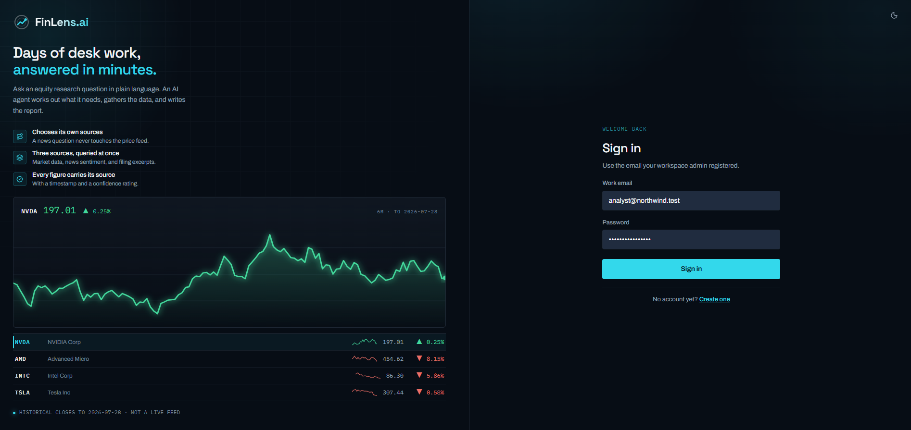
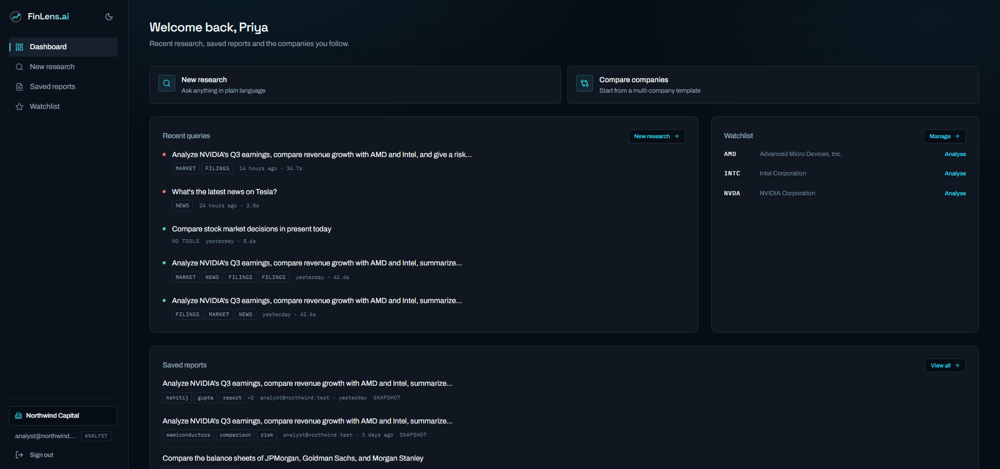
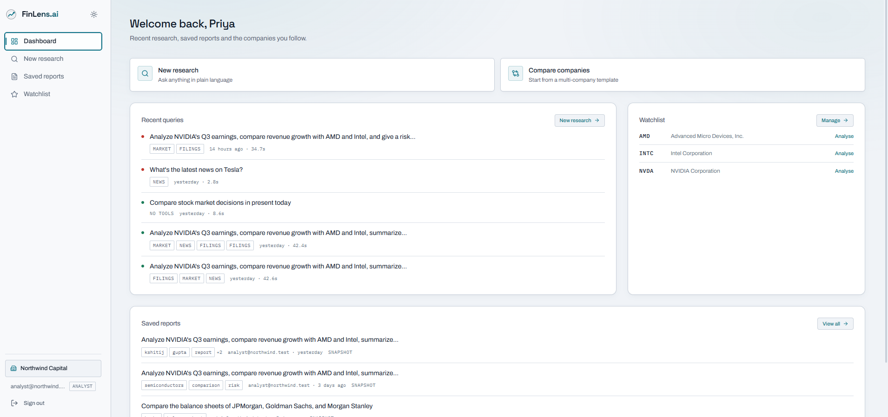
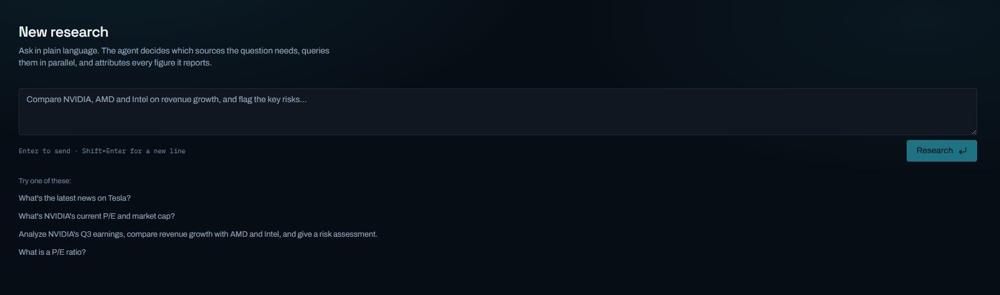
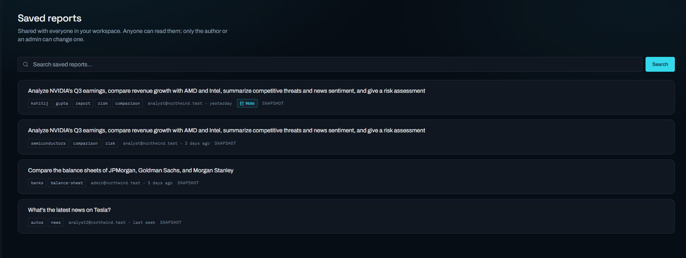
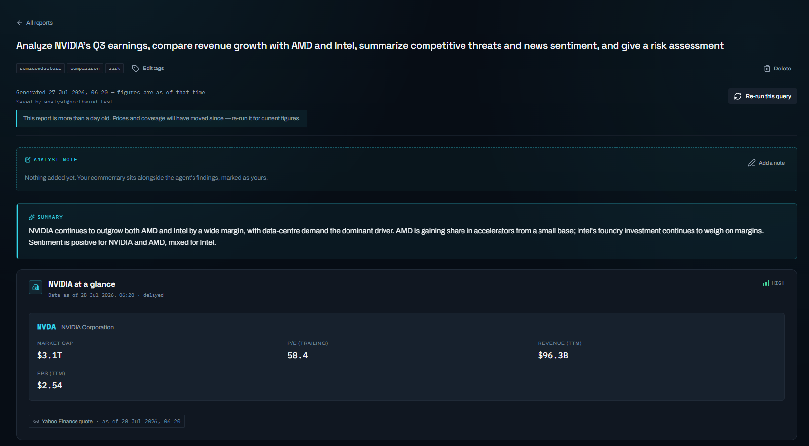
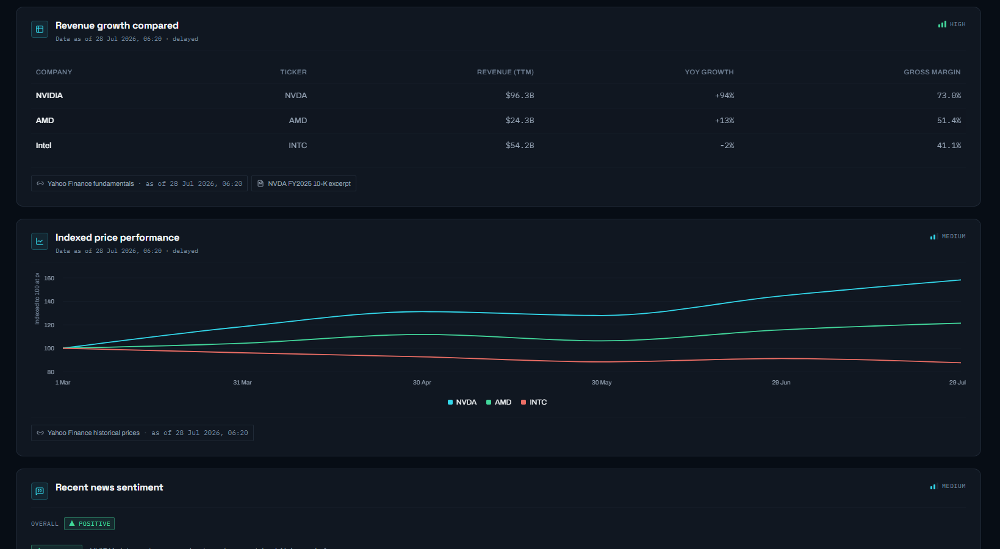
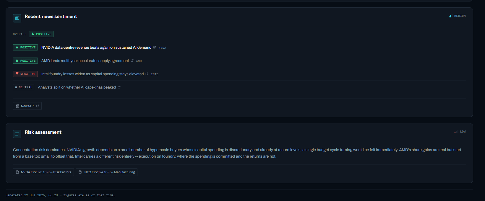

# FinLens.ai

Multi-tenant SaaS where equity analysts ask natural-language research questions and
an AI agent decides, per query, which data tools to call, then returns a structured,
source-attributed report rendered as real UI components.

> **Option A: Investment Research Dashboard**

| | |
|---|---|
| **Docs** | [ARCHITECTURE.md](ARCHITECTURE.md) · [DECISIONS.md](DECISIONS.md) |
| **API reference** | `http://localhost:8000/docs` once running |
| **Tests** | 453 across 20 modules |

---

## Why this option

Its core requirement, an agent that selects tools per query, is the hardest thing in
the brief to fake. A keyword router would pass a scripted demo but fail the
acceptance tests, which deliberately include a question needing *zero* tools and one
needing all three. Choosing this option meant the graded behaviour had to be real.

There is no keyword routing anywhere in the codebase. Tool selection is recorded per
query in `research_queries`, so it is auditable rather than asserted:

| Query | Tools the model selected |
|---|---|
| What is a P/E ratio? | *none, answered directly* |
| What's NVIDIA's current P/E and market cap? | `get_market_data` |
| What's the latest news on Tesla? | `get_news_sentiment` |
| Analyze NVIDIA's Q3 earnings, compare with AMD and Intel, summarize competitive threats and news sentiment | `get_market_data`, `get_news_sentiment`, `search_knowledge_base` ×2 |

The equity-research domain also produces naturally structured output (comparison
tables, company cards, price charts, sentiment), which makes the fixed response
schema a genuine contract rather than a wrapper around prose.

---

## Tech stack

| Layer | Choice | Why |
|---|---|---|
| Frontend | Next.js 14 (App Router), TypeScript, Tailwind, shadcn/ui | Server Components run the auth check and data fetch *before* any HTML is sent, so there is no flash of a protected page. The access token never reaches the browser. |
| Backend | FastAPI (Python 3.13), async | Parallel tool execution needs `asyncio.gather`. Pydantic validates request bodies and LLM output with one mental model. OpenAPI docs come free. |
| Database | PostgreSQL via Supabase | `jsonb` for stored reports, `text[]` + GIN for tags, full-text search for query text. Relational integrity is what makes tenant isolation enforceable. |
| Auth | Supabase Auth (JWT, ES256/RS256) | Asymmetric signing: the backend verifies with a public key and could never forge a token. |
| Data access | `asyncpg`, no ORM | Every query shows its `where org_id = $n` in plain SQL. With an ORM the tenant filter hides behind a query-builder call and is easier to omit. |
| LLM | Google Gemini `gemini-3.6-flash` via `google-genai` | Function calling for planning, forced-call structured output for synthesis, and sentiment classification. No LangChain: the orchestration is ~200 lines and a framework would obscure the timeouts and partial-result handling that are graded. |
| Market data | yfinance primary, Alpha Vantage fallback | Both behind one `MarketDataClient` protocol, so the provider is configuration rather than a rewrite. |
| News | NewsAPI | Sentiment is classified by the LLM, not the provider. |
| Knowledge base | BM25 (`rank_bm25`) over seeded filing excerpts | Lexical search, explainable, and no embedding model or vector store needed for a 32-chunk corpus. |

Full reasoning, including alternatives rejected, is in [DECISIONS.md](DECISIONS.md).

---

## Screenshots

### Sign in



### Dashboard

Every past query records which tools the agent chose for it: `MARKET`, `NEWS`,
`FILINGS`, or `NO TOOLS`. Tool selection is per query, and it is visible here
rather than only claimed.



### Light theme

Both themes are first-class. The toggle sits in the sidebar and persists.



### New research

Plain-language input, with the acceptance queries offered as suggestions.



### Saved reports

Shared across the organisation and filterable by tag. Only the author or an admin
can change one, and annotated reports carry a `Note` badge.



### A generated report, end to end

The output of *"Analyze NVIDIA's Q3 earnings, compare revenue growth with AMD and
Intel, summarize competitive threats and news sentiment, and give a risk
assessment"* — a query the agent answered with all three tools. Three parts, top
to bottom.

**1.** Tags, a staleness banner once a report is over a day old, the analyst-note
slot, the summary, and a company card whose figures cite Yahoo Finance with the
timestamp they were read at.



**2.** A comparison table and an indexed price chart, each carrying its own
confidence rating and provider attribution.



**3.** Per-article sentiment classified by the LLM, then a risk assessment rated
`LOW` confidence and cited to specific filing sections.

All three confidence levels appear across this one report: `HIGH` where figures
come straight from a provider, `MEDIUM` for inference, `LOW` where the data is
thin or a tool returned little.



---

## Setup

You need a free [Supabase](https://supabase.com) project and a free
[Gemini API key](https://aistudio.google.com/apikey). A [NewsAPI](https://newsapi.org)
key is optional; without it the news tool degrades rather than failing.

### 1. Configure

```bash
git clone https://github.com/kshitijgupta0707/FinLens.git
cd FinLens

cp .env.example .env
cp frontend/.env.local.example frontend/.env.local
```

Fill in `.env`. Every field is documented in the file. Two that commonly trip
people up:

- **`DATABASE_URL`** must be the Supabase **session pooler** string, not the direct
  `db.<ref>.supabase.co` host. The direct host is IPv6-only and times out on many
  networks. The pooler username is `postgres.<project-ref>`, not `postgres`.
- **`SUPABASE_SECRET_KEY`** and **`SUPABASE_PUBLISHABLE_KEY`** are the new `sb_secret_`
  and `sb_publishable_` keys, not the legacy `service_role` / `anon` JWTs.

`frontend/.env.local` needs only the Supabase URL and publishable key, plus the API
base URL. Nothing secret goes in it.

### 2. Run with Docker (recommended)

```bash
# One-time database setup, run inside the backend image
docker compose run --rm backend python scripts/migrate.py
docker compose run --rm backend python scripts/ingest_kb.py
docker compose run --rm backend python scripts/seed_data.py

# Start both services
docker compose up --build
```

Frontend on <http://localhost:3000>, API on <http://localhost:8000>.

The frontend waits for the backend's `/health` check before starting, so the first
page load cannot race the API.

### 3. Or run locally without Docker

Requires Python 3.13+ and Node 20+.

```bash
python -m venv .venv
.venv/Scripts/pip install -r backend/requirements.txt      # Windows
# source .venv/bin/activate && pip install -r backend/requirements.txt   # macOS/Linux

python backend/scripts/migrate.py
python backend/scripts/ingest_kb.py
python backend/scripts/seed_data.py
```

Then in two terminals:

```bash
cd backend && uvicorn app.main:app --reload    # http://localhost:8000
cd frontend && npm install && npm run dev      # http://localhost:3000
```

### What the setup scripts do

| Script | Effect | Safe to re-run? |
|---|---|---|
| `migrate.py` | Applies the numbered SQL migrations: schema, indexes, RLS policies | Yes, applies only what is pending. `--status` reports without changing anything |
| `ingest_kb.py` | Chunks the filing excerpts in `backend/data/kb/` and loads them into `kb_documents` | Yes, replaces rows per ticker |
| `seed_data.py` | Creates two demo organisations with users, reports, history and watchlists, and provisions the Supabase Auth accounts | Yes, it is a reset rather than an accumulation. Use `--db-only` if you have no `SUPABASE_SECRET_KEY` |

---

## Demo accounts

`seed_data.py` prints these on completion. Password for all of them:
`Demo-Passw0rd!42`

| Organisation | Email | Role |
|---|---|---|
| Northwind Capital | `admin@northwind.test` | Admin |
| Northwind Capital | `analyst@northwind.test` | Analyst |
| Northwind Capital | `analyst2@northwind.test` | Analyst |
| Vector Partners | `admin@vector.test` | Admin |
| Vector Partners | `analyst@vector.test` | Analyst |

Two organisations exist so tenant isolation is demonstrable, and Northwind has two
analysts so the ownership rule is too: an analyst cannot edit or delete a report
another analyst saved.

---

## Things worth trying

**Selective tool use.** Run these and compare the *Tools used* line on each result:

```
What is a P/E ratio?                          → no tools, answered directly
What's the latest news on Tesla?              → news only, no market data call
What's NVIDIA's current P/E and market cap?   → market data only
Compare the balance sheets of JPMorgan, Goldman Sachs and Morgan Stanley
                                              → market data + knowledge base
```

**Tenant isolation.** Sign in as Northwind, copy a report URL, sign in as Vector and
open it. You get a 404, not a 403: another organisation's report is indistinguishable
from one that does not exist.

**Role enforcement.** Sign in as an Analyst. The Organisation nav item is hidden, and
calling the endpoint directly returns 403:

```bash
curl -H "Authorization: Bearer <analyst-token>" http://localhost:8000/api/org/members
```

**Graceful degradation.** Remove `NEWSAPI_API_KEY` from `.env`, restart, and run a
query that needs news. The report still renders from the other tools with a
partial-data banner rather than failing.

---

## Tests

```bash
cd backend
pytest -m "not integration"    # 417 unit tests, no external services needed
pytest                         # all 453, requires a configured .env
```

Coverage includes agent tool selection, executor degradation under tool failure,
tenant isolation, RBAC, report CRUD, and the knowledge-base pipeline.

---

## Known limitations

Stated plainly rather than omitted. Reasoning for each is in
[DECISIONS.md](DECISIONS.md) §6.

**Not implemented**

- **No response caching.** Repeated identical queries re-run the full pipeline,
  including billable LLM calls.
- **No application-level rate limiting.** Upstream 429s are handled and degraded, but
  the API imposes no limits of its own, so an authenticated user could exhaust the
  Gemini free tier.
- **No CI/CD.** Tests run locally; there is no `.github/workflows`.
- **No monitoring or alerting** beyond structured JSON logs.
- **No streaming.** A three-tool query takes roughly 40 seconds with a loading
  skeleton and no intermediate output.
- **No background jobs or scheduled refresh.**
- **No conversation history.** Each query is independent; there is no follow-up
  context.

**Constraints of the data sources**

- **Quotes are delayed, not live.** Free tiers serve delayed or end-of-day prices.
  Every figure carries a `data_as_of` timestamp and is never labelled "live".
- **Saved reports are frozen snapshots.** A report saved on Monday shows Monday's
  figures forever. This is intentional for research, and the UI states the date the
  report speaks for. "Re-run this query" produces a fresh report and leaves the
  original intact.
- **The knowledge base is synthetic.** The filing excerpts for seven companies are
  illustrative samples, and every source label says so. They are not real SEC
  filings.
- **BM25 is lexical.** A query about "chip supply" will not match text about "wafer
  capacity". There is no embedding step.
- **NewsAPI's free tier serves roughly the last 28 days**, which caps the news window
  regardless of the `days` argument the model requests.
- **Alpha Vantage's free tier allows 25 requests per day**, which is why it is the
  fallback rather than the primary provider.

